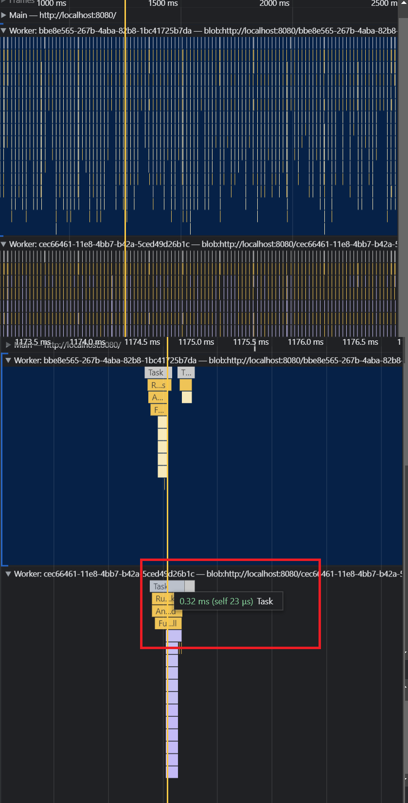

# MazeSwarm
Flowfields, Mazes, with Rapier physics + BablyonJS 3D

[Playable Demo](https://mazeswarm.netlify.app) 

Find the exit, escape the swarm! Use the map to help find the keys and the exit. 

BabylonJS for rendering. Rapier3D for scene collision and scripting interactions. All entities are physics-based and update the render thread.

Physics thread uses a separate thread to convolve the main flowfield that tracks the player from all points in the maze for navigating ai to you. Idle AI will alternate accessible flowfield points on separate convolved layers that can be purposed of other targets too.

BabylonJS thread handles only the render updating while positions and states etc. are determined by the physics thread. 

Main thread just passes user inputs to babylonjs to update the render with simple vector calc.

Many many things left undone, we have a future game planned around this general idea but this is far away from that.

### To run:

`npm i -g tinybuild & tinybuild` if you don't have [tinybuild](https://github.com/joshbrew/tinybuild) installed.

then 

`npm start` or `tinybuild`

### About

Rapier3D: fancy Rust -> JS WASM physics engine, it's faster than anything else free.

Benchmarks: https://www.dimforge.com/blog/2020/08/25/announcing-the-rapier-physics-engine/

BabylonJS: fancy JS rendering engine, including lots of extras. Little fatter than ThreeJS but heavier on game engine features.

Homemade Maze generation with Flowfield pathfinding for efficient swarm physics. AStar is used to generate door and key placements to ensure it's always solvable.

Runs at 60-100fps no problem on my laptop, plenty could be further optimized as well as quality of life improvements to the code organization but we worked hot and fast to make this functional.

### Benchmark

Baseline performance is on the order of microseconds. This is just with two crowd entities, a player, a number of other physics objects, and a single light source.
